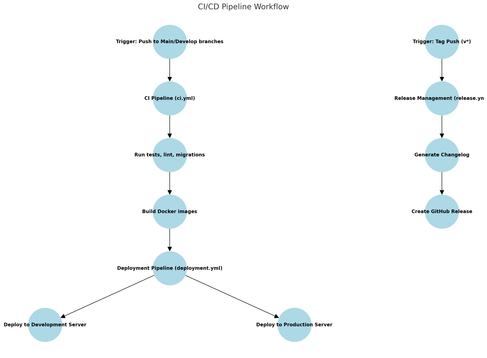

# CI/CD Pipeline Documentation

## Overview
This document describes the Continuous Integration and Continuous Deployment (CI/CD) pipeline implemented for the Tiqets Order Processor. The pipeline automates testing, building, and deployment processes using GitHub Actions.

## Pipeline Architecture

### Workflow Structure
```
.github/workflows/
├── ci.yml         # Main CI pipeline
├── deployment.yml # Deployment workflow
└── release.yml    # Release management
```

### Pipeline Workflow

The following diagram illustrates the CI/CD pipeline's workflow, showing the triggers, jobs, and stages involved:

**Pipeline Diagram:**


### Environments
- **Development**: Automated deployments from `develop` branch
- **Production**: Automated deployments from `main` branch
- **Feature Branches**: CI checks only

## CI Pipeline (ci.yml)

### Trigger Events
- Push to `main` and `develop` branches
- Pull requests to `main` and `develop`

### Jobs and Stages

1. **Test Stage**
   ```yaml
   test:
     runs-on: ubuntu-latest
     services:
       postgres:
         image: postgres:15
         env:
           POSTGRES_DB: tiqets_db
           POSTGRES_USER: admin
           POSTGRES_PASSWORD: admin
   ```
   
   Steps:
   - Python setup with Poetry
   - Dependencies installation
   - Database migrations
   - Test execution with coverage
   - Code linting (black)

2. **Build Stage**
   ```yaml
   build:
     needs: test
     runs-on: ubuntu-latest
     if: github.event_name == 'push'
   ```
   
   Steps:
   - Docker image building (Backend & Frontend)
   - Image tagging with commit SHA
   - Push to Docker Hub registry

## Deployment Pipeline (deployment.yml)

### Trigger Events
- Successful completion of CI pipeline on `main` or `develop`

### Deployment Process
```yaml
deploy:
  runs-on: ubuntu-latest
  if: ${{ github.event.workflow_run.conclusion == 'success' }}
```

Steps:
1. Development Environment (develop branch)
   - Connect to development server
   - Pull latest Docker images
   - Run database migrations
   - Restart services

2. Production Environment (main branch)
   - Connect to production server
   - Pull latest Docker images
   - Run database migrations
   - Restart services

## Release Management (release.yml)

### Trigger Events
- Tag push with pattern 'v*'

### Release Process
1. Changelog Generation
   - Uses release-changelog-builder-action
   - Configured via changelog-config.json
   
2. GitHub Release Creation
   - Creates release with generated changelog
   - Attaches built artifacts

## Required Secrets
```
DOCKERHUB_USERNAME      # Docker Hub username
DOCKERHUB_TOKEN        # Docker Hub access token
DEV_HOST              # Development server hostname
PROD_HOST             # Production server hostname
SSH_USERNAME          # SSH username for deployment
SSH_PRIVATE_KEY       # SSH private key for deployment
```

## Testing the Pipeline

### Manual Triggers
1. Push to develop:
   ```bash
   git checkout develop
   git push origin develop
   ```

2. Create release:
   ```bash
   git tag v1.0.0
   git push origin v1.0.0
   ```

## Pipeline Features

### Security
- Secrets management via GitHub Secrets
- Docker Hub authentication
- SSH key-based deployment

### Performance
- Parallel job execution
- Dependency caching
- Conditional job execution

### Reliability
- Health checks for services
- Deployment rollback capability
- Error handling and notifications

## Monitoring and Logs

### GitHub Actions Dashboard
- Pipeline execution history
- Job logs and artifacts
- Success/failure statistics

### Server Logs
Access deployment logs:
```bash
# Development
ssh user@dev-host "docker-compose logs -f"

# Production
ssh user@prod-host "docker-compose logs -f"
```

## Best Practices Implemented

1. **Branch Protection**
   - Required CI checks
   - Pull request reviews
   - Branch up-to-date check

2. **Code Quality**
   - Automated testing
   - Code coverage reporting
   - Style enforcement

3. **Deployment Safety**
   - Environment-specific configurations
   - Database migration handling
   - Health checks

## Future Improvements

1. **Testing Enhancements**
   - E2E testing integration
   - Performance testing
   - Security scanning

2. **Deployment Features**
   - Blue-green deployments
   - Canary releases
   - Automated rollbacks

3. **Monitoring**
   - Prometheus metrics
   - Grafana dashboards
   - Alert integration

## Appendix

### Workflow Files
Key workflow files are located in `.github/workflows/`:

#### ci.yml Example
```yaml
name: CI Pipeline
on:
  push:
    branches: [ main, develop ]
  pull_request:
    branches: [ main, develop ]

jobs:
  test:
    runs-on: ubuntu-latest
    services:
      postgres:
        image: postgres:15
        env:
          POSTGRES_DB: tiqets_db
          POSTGRES_USER: admin
          POSTGRES_PASSWORD: admin