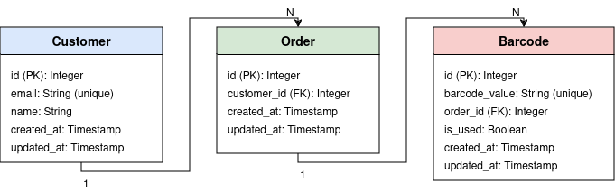

# Data Model Documentation

## Overview
The data model for the Tiqets Order Processor represents the relationships between customers, orders, and barcodes. It is designed to efficiently handle order processing, analytics, and API interactions.

---

## Data Model Diagram

Below is the diagram illustrating the relationships between the entities:



---

## Entity Descriptions

### **Customer**
Represents a customer in the system.
- **Attributes**:
  - `id (PK)`: Unique identifier for the customer (Integer).
  - `email`: Customer's email address (String, unique).
  - `name`: Customer's name (String).
  - `created_at`: Timestamp of customer creation.
  - `updated_at`: Timestamp of the last update to the customer.

---

### **Order**
Represents an order placed by a customer.
- **Attributes**:
  - `id (PK)`: Unique identifier for the order (Integer).
  - `customer_id (FK)`: Reference to the `Customer` entity (Integer).
  - `created_at`: Timestamp of order creation.
  - `updated_at`: Timestamp of the last update to the order.

---

### **Barcode**
Represents a barcode associated with an order.
- **Attributes**:
  - `id (PK)`: Unique identifier for the barcode (Integer).
  - `barcode_value`: Unique value of the barcode (String, unique).
  - `order_id (FK)`: Reference to the `Order` entity (Integer).
  - `is_used`: Boolean indicating if the barcode has been used.
  - `created_at`: Timestamp of barcode creation.
  - `updated_at`: Timestamp of the last update to the barcode.

---

## Relationships

### 1. **Customer → Order**
- **Type**: One-to-Many
- **Details**: Each customer can place multiple orders.

### 2. **Order → Barcode**
- **Type**: One-to-Many
- **Details**: Each order can have multiple associated barcodes.

---

## Indexing Strategies
To optimize database performance and support efficient querying, the following indexing strategies are recommended:

### **Customer**
- **Index on `email`**: Enables fast lookups for customer identification.

### **Order**
- **Index on `customer_id`**: Optimizes queries fetching all orders for a specific customer.

### **Barcode**
- **Index on `barcode_value`**: Ensures quick validation of barcode uniqueness.
- **Composite index on `order_id` and `is_used`**: Improves performance for queries retrieving unused barcodes.

---

## Database Migrations

### **Alembic**
Alembic is used to manage database migrations for the Tiqets Order Processor. It ensures that database schema changes are consistent and version-controlled.

### **Migration Commands**
1. **Initialize Alembic**:
   ```bash
   alembic init migrations
   ```

2. **Create a New Migration**:
   When changes are made to the models, generate a new migration file:
   ```bash
   alembic revision --autogenerate -m "Add new feature or change"
   ```

3. **Apply Migrations**:
   Update the database to match the current schema:
   ```bash
   alembic upgrade head
   ```

4. **Rollback a Migration**:
   Undo the last migration if needed:
   ```bash
   alembic downgrade -1
   ```

For detailed usage, refer to the [Alembic Documentation](https://alembic.sqlalchemy.org/).

---

## Future Considerations

### **1. Denormalization**
- The current model is fully normalized for consistency and clarity. However, denormalization strategies could be adopted in the future to improve performance for high-read scenarios.
- Example: Storing a precomputed `ticket_count` in the `Customer` table to reduce query complexity for top customer analytics.

### **2. Caching**
- Implementing caching for frequently accessed queries can significantly reduce database load during heavy traffic.
- Suggested caching strategies:
  - Cache results for top customers by ticket count.
  - Cache the list of unused barcodes.
- Tools like Redis could be used for this purpose.

### **3. Partitioning**
- For very large datasets, partitioning tables can improve query performance and simplify data management:
  - Partition the `Order` and `Barcode` tables by **Order Date** to allow archiving of older data.
  - Partition by **Customer ID** to optimize customer-specific operations.

These strategies are not yet implemented but are recommended for scaling the system as the data volume and traffic grow.

---

## Database Schema
```sql
CREATE TABLE customers (
    id SERIAL PRIMARY KEY,
    email VARCHAR(255) UNIQUE NOT NULL,
    name VARCHAR(255) NOT NULL,
    created_at TIMESTAMP DEFAULT CURRENT_TIMESTAMP,
    updated_at TIMESTAMP DEFAULT CURRENT_TIMESTAMP
);

CREATE TABLE orders (
    id SERIAL PRIMARY KEY,
    customer_id INTEGER NOT NULL REFERENCES customers(id),
    created_at TIMESTAMP DEFAULT CURRENT_TIMESTAMP,
    updated_at TIMESTAMP DEFAULT CURRENT_TIMESTAMP
);

CREATE TABLE barcodes (
    id SERIAL PRIMARY KEY,
    barcode_value VARCHAR(255) UNIQUE NOT NULL,
    order_id INTEGER REFERENCES orders(id),
    is_used BOOLEAN DEFAULT FALSE,
    created_at TIMESTAMP DEFAULT CURRENT_TIMESTAMP,
    updated_at TIMESTAMP DEFAULT CURRENT_TIMESTAMP
);
```

---

## Usage
This data model is used in the Tiqets Order Processor to:
- Manage customer information.
- Track orders and their associated barcodes.
- Perform analytics, such as identifying top customers or unused barcodes.
