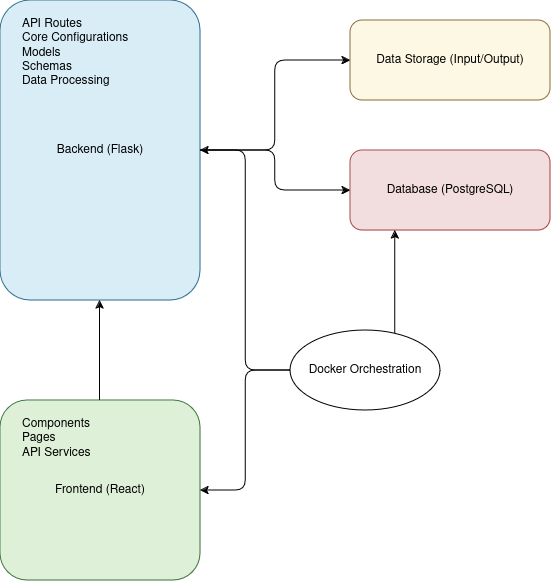

# System Architecture

## Overview

This document provides an overview of the system architecture for the Tiqets Order Processor. The architecture is designed to support efficient data processing, robust API functionality, and a scalable frontend for user interactions.
The architecture is designed with modularity in mind, allowing individual components to be developed, tested, and deployed independently.
---

## Architecture Diagram

Below is the diagram illustrating the key components of the Tiqets Order Processor system and their interactions.

---

## Components

### 1. **Frontend (React)**

- **Purpose**: Provides a user interface for visualizing data, managing orders, and viewing analytics.
- **Subcomponents**:
  - **Components**: Reusable UI elements.
  - **Pages**: Full-page components for routes.
  - **API Services**: Interfaces for communication with the backend.

### 2. **Backend (Flask)**

- **Purpose**: Handles API requests, processes data, and manages interactions with the database and storage.
- **Subcomponents**:
  - **API Routes**: Endpoints for order processing, analytics, and customer management.
  - **Core Configurations**: Configuration settings and middleware.
  - **Models**: ORM models for database interaction.
  - **Schemas**: Validation logic for input and output data.
  - **Data Processing**: Custom logic for merging, validating, and transforming data.

### 3. **Database (PostgreSQL)**

- **Purpose**: Stores structured data such as customers, orders, and barcodes.
- **Features**:
  - Optimized for relational data.
  - Integrated with SQLAlchemy ORM for efficient querying.

### 4. **Data Storage**

- **Purpose**: Manages raw input files and processed results.
- **Structure**:
  - **Input Directory**: Stores uploaded CSV files (orders.csv, barcodes.csv).
  - **Output Directory**: Contains processed data for further analysis (processed\_orders.csv).

### 5. **Docker Orchestration**

- **Purpose**: Provides containerized environments for consistent deployment.
- **Components**:
  - Backend Container
  - Frontend Container
  - Database Container

---

## Data Flow

1. **Input**: CSV files are uploaded to the `data/input/` directory.
2. **Validation**: Files are validated using Pandera (schema-level) and Marshmallow (API-level).
3. **Processing**: Data is merged and transformed by the backend logic.
4. **Storage**: Processed data is saved to the database or output files.
5. **Visualization**: Results are fetched via API endpoints and displayed in the frontend dashboard.

